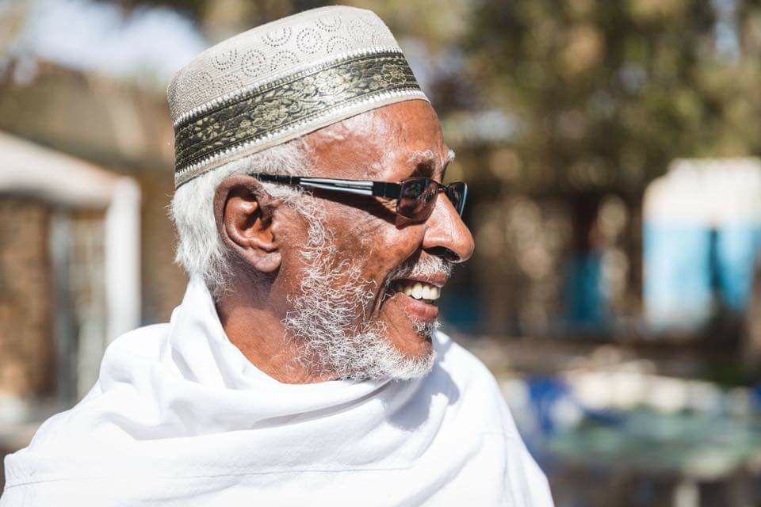

<!DOCTYPE html>
<html>
<head>
<meta name="viewport" content="width=device-width, initial-scale=1.0">
<link rel="stylesheet" href="./responsive.css">

</head>
<body style="font-family:Verdana;color:#aaaaaa;">

  <h1>Abwaan Hadraawi</h1>
  

  

    <a href="https://www.youtube.com/watch?v=beMHSzswWUY&ab_channel=HeersareShow">Dabahuwan</a> 
        <a href="https://www.youtube.com/watch?v=ydfbRMHMyCI&t=1929s&ab_channel=RamaasnewsOnlineTv">Sirta Nolosha</a> 
        <a href="https://www.youtube.com/watch?v=CFHC_TaQiOU&ab_channel=SomalilandHD">Gudgude</a>
  

  

    <h2>Maxamed Ibraahim Warsame</h2>
    <pre>
            maxaan dogob beer is iri
            daruuro usoo sasabay
            daryeelka ku maal is iri 
            biyihu uga sii dareen 
            waxaan degdeg shay ku liqay
            maxay shishe ii damqeen 
            kashayda dalooshadeen 
            muxuu hadba shay dellegan
            dareensigu soo tuf iyiri

        </pre>
  

  

    <h2>About</h2>
    
waxa uu ku dhashay magaalada burco ee gobolka Togdheer sannadklii 1943 ,waxa uuna dhintay 2022 Allaha unaxariisto waxa uu ka tagay dhaxal

  

© copyright Garaad.com

</body>
</html>

